# Linear and Logistic Regression

## Linear Regression via Least Squares Minimization

* Ordinary least squares (or OLS) regression
* Different types of machine learning
* Linear models
* Terminology in linear model problems
* 1-dimensional OLS and minimizing the loss function
* Interpreting parameters in an OLS equation
* Limitations of using OLS through Anscombe’s Quartet
* Multivariate OLS models and an example problem
* Using matrix foundation to solve the OLS problem
* The pros and cons of using OLS regression

Ordinary Least Squares

### Types of Machine Learning

* Unsupervised: finds structure in data without explicit labels - regression - continuous input
* Supervised: predicts - learns a function that approximate relationship between input and output data - classification (OLS & logistic regression)

In linear modeling, the relationship between each individual input variables and the output is a straight line. Slopes of such lines become the coefficients of the linear equation. (yi = a0 + a1x1+ a2x2 +…)

1. Interpretable
2. Low complexity
3. Scalable

### Definition of 1-Dimension Ordinary Least Squares (OLS)
### Solution of Ordinary Least Squares (OLS)
Interpretation of a and b
–
a – slope of the line (size of relationship between X and Y)

b – intercept

Interpretation of L
–
In general, R2∈ [0,1]

Let’s observe the model performance with the help of R2 which is defined as. Keep in mind, L = loss function. 

### Anscombe’s Quartet

R2 can be prone to error measuring.

### Multivariate Ordinary Least Squares (OLS)

Use matrices

### Optimization

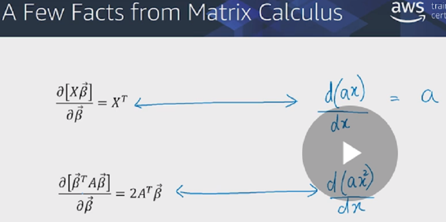

### Ordinary Least Squares (OLS) Pros and Cons

Pros:
* efficient computation
* unique minimum
* stable under perturbation of data
* easy to interpret

Cons:
* influenced by outliers
* (X Transposed X)exp -1 need not exist

## Linear Regression: A probabilistic approach

* The definition of a probabilistic approach
* Maximum Likelihood Estimate (MLE)
* MLE for the case of continuous probability with probability density function
* Gaussian MLE
* OLS as MLE
* Reformulate OLS model
* OLS likelihood function
* Minimizing MSE = Maximizing MLE
* Improvements in MLE

### Maximum Likelihood Estimate (MLE)

In an OLS model, the choice of least squares is arbitrary.

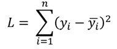

Why are we only choosing the power of 2, and not the sum of cubes or other degree values?

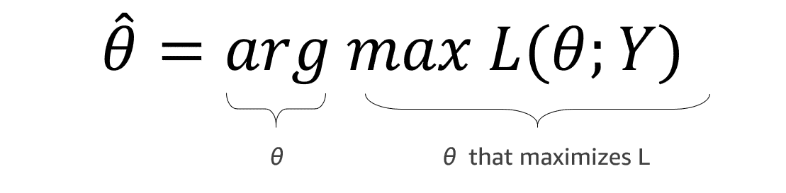

### Continuous Probability

#### Discrete Random Variables: Sum of two dice

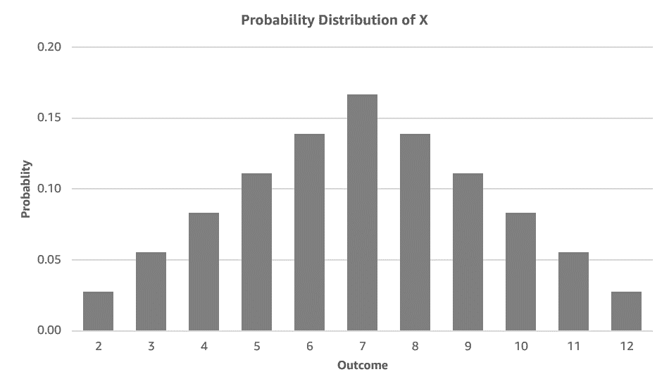

#### Continuous Random Variable: Probability density function

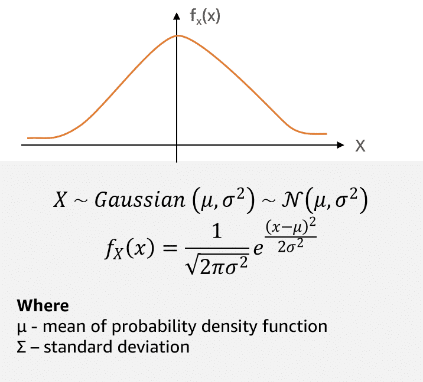

Probability Density Function for Continuous Random Variables

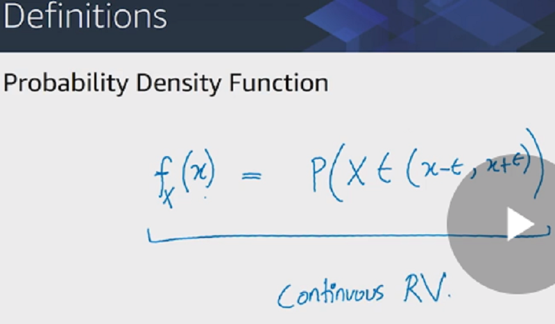

#### Gaussian Random Variables

Probability Density Function for Gaussian Random Variables

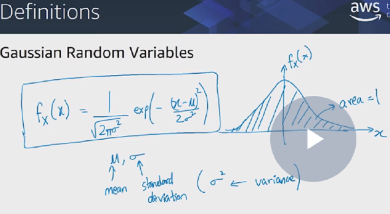

...

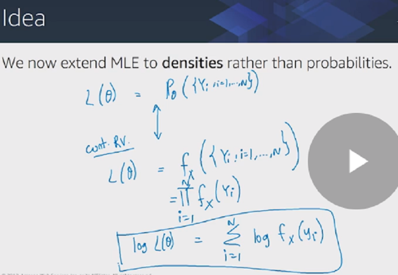

### Gaussian Maximum Likelihood Estimate (MLE)

Maximize L => minimize sum of squared errors

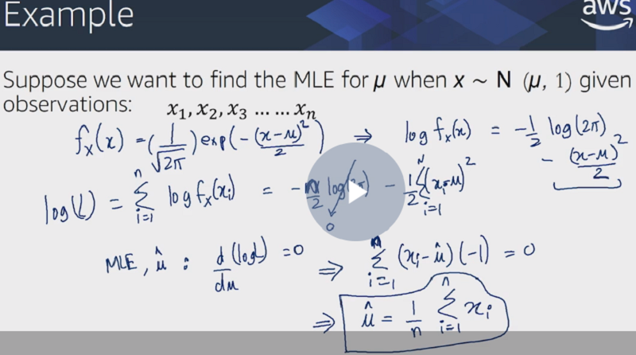

### Ordinary Least Squares (OLS) as Maximum Likelihood Estimation (MLE)

Model

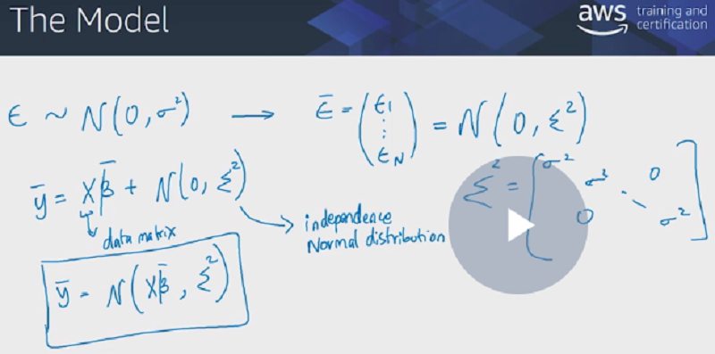

### Ordinary Least Squares (OLS) Likelihood Function

Matrix notation

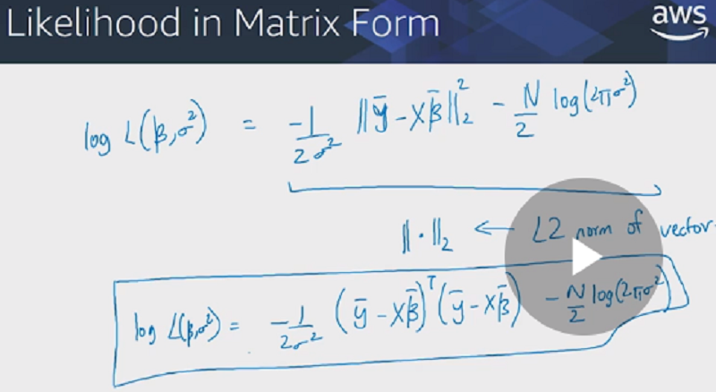

### Minimize MSE (mean squared error) <-> MLE

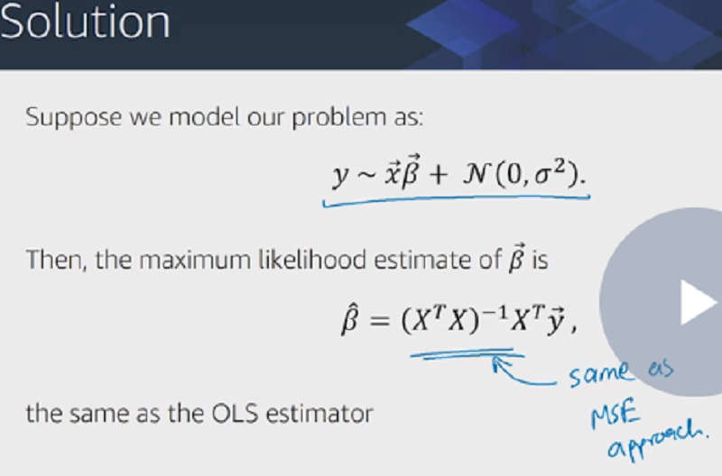

### The MLE Point of View

* Define the model
* Discover parameters fitting data giving highest probability
* MLE is minimum log likelihood function
* As Least Squared solution approach : MSE

### Improvements in Maximum Likelihood Estimate (MLE)

Column A | Column B | Column C | Column D
---------|----------|----------|---------
 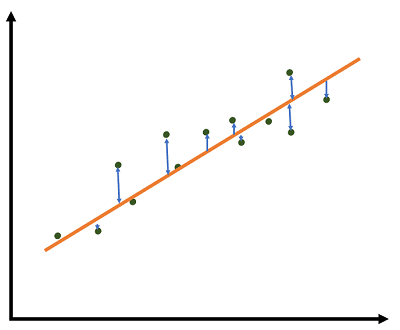 | 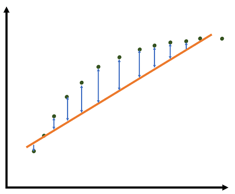 | 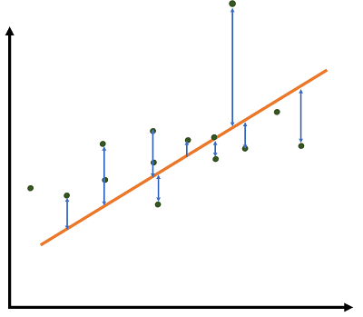 | 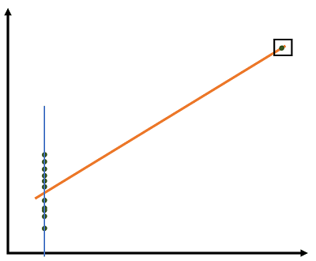
 Symmetric errors distributed around the prediction. Normal distribution then model valid | Less error in extremes. It can be modeled as function of x. Errors are not independent of x. MLE does not fit | Errors distributed symmetric but outliers. Ignore outlier or modify the error model | If ignore outlier, a single value of x has many predictions => output independent of input. Not normal, not independent. Model does not fit
