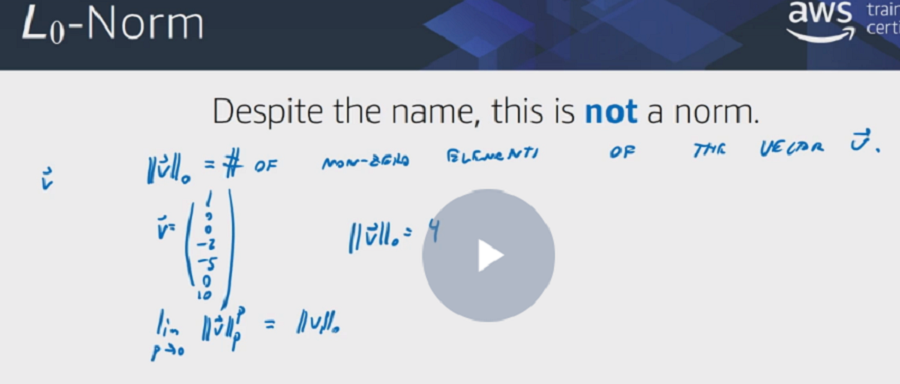
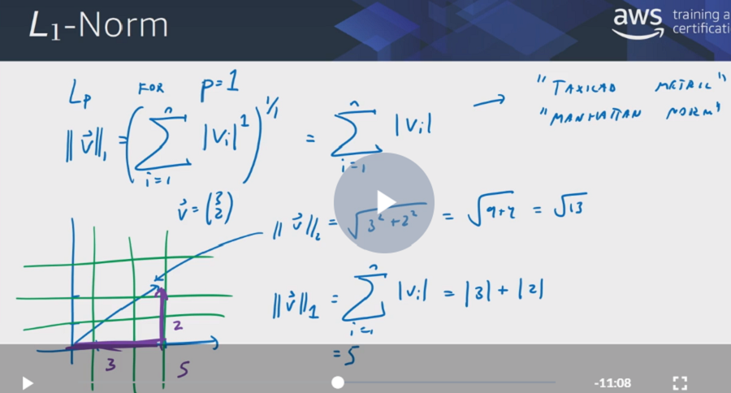
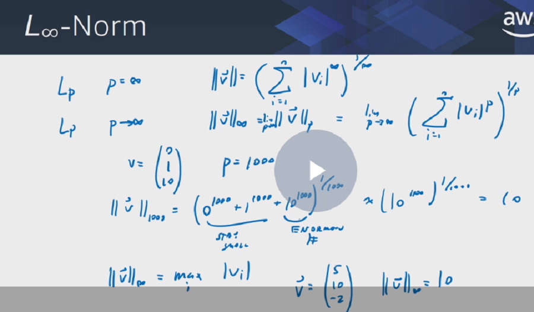
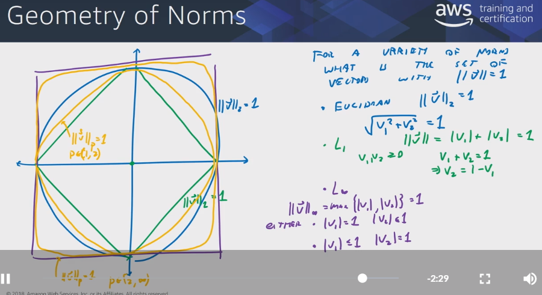

# Math for Machine Learning

## Vectors

### Measures of magnitude

#### L0 norm - not norm - aka sparsity - non zero count

#### L1 norm

#### L Infinity norm

#### L2 norm

#### L norm comparison

## Matrices

### A motivating example

### Dot Products and how to extract angles

### Matrix multiplication and examples

### Hadamard product

### Matrix product properties

### Geometry of matrix operations

### Determinant computation

### Matrix invertibility

### Linear dependency
