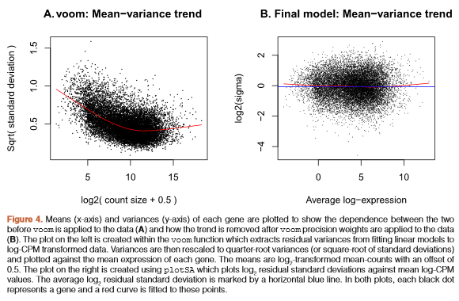
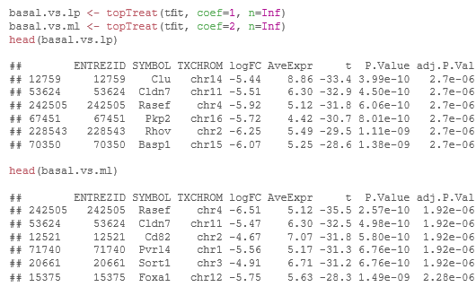
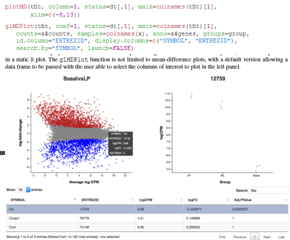
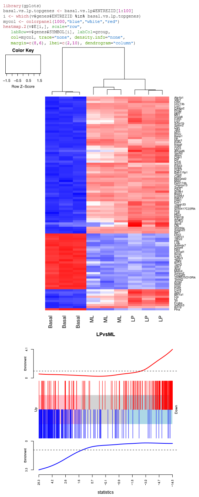
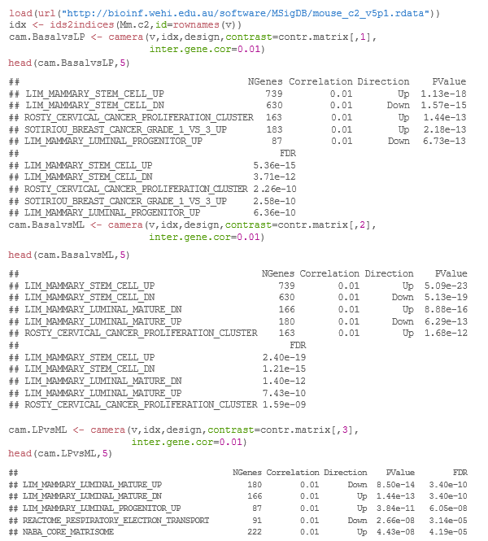

```{r setup, include=FALSE}
knitr::opts_chunk$set(echo = TRUE);
library(limma);
library(edgeR);
library(Mus.musculus);
library(RColorBrewer);
library(Glimma);
```

# Data packaging

## Reading in count-data

```{r reading}
fileList <- list.files(path="Data/", pattern = "*.txt$");
fileList;
read.delim(paste0("Data/", fileList[1]), nrow=5);
x <- readDGE(files = fileList, path = "Data/", columns=c(1,3));
class(x);
dim(x);
```

## Organizing Sample Info

```{r organising}
samplenames <- substring(colnames(x), 12, nchar(colnames(x)));
samplenames;
colnames(x) <- samplenames;
group <- as.factor(c("LP", "ML", "Basal", "Basal", "ML", "LP", "Basal", "ML", "LP"));
x$samplesgroup <- group;
lane <- as.factor(rep(c("L004","L006","L008"), c(3,4,2)));
x$sampleslane <- lane;
x$samples
```

## Organizing gene annotations

```{r organizing gene}
geneid <- rownames(x);
genes <- select(Mus.musculus, keys=geneid, columns=c("SYMBOL", "TXCHROM"),  keytype="ENTREZID");
head(genes);
dup <- genes$ENTREZID[duplicated(genes$ENTREZID)];
genes[genes$ENTREZID %in% dup,][1:10,];
mat <- match(geneid, genes$ENTREZID);
genes <- genes[mat,];
genes[genes$ENTREZID %in% dup,][1:5,];
x$genes <- genes;
x;
```

# Data pre processing

## Transformations from the raw-scale

```{r transformations}
cpm <- cpm(x);
lcpm <- cpm(x, log=TRUE);
table(rowSums(x$counts==0)==9);
keep.exprs <- rowSums(cpm>1)>=3;
x <- x[keep.exprs,, keep.lib.sizes=FALSE];
dim(x);
nsamples <- ncol(x);
col <- brewer.pal(nsamples, "Paired");
par(mfrow=c(1,2));
plot(density(lcpm[,1]),
     col=col[1],
     lwd=2,
     ylim=c(0,0.21),
     las=2,
     main="",
     xlab="");
title(main="A. Raw data",
      xlab="Log-cpm");
abline(v=0, lty=3);
for (i in 2:nsamples){
  den <- density(lcpm[,i]);
  lines(den$x,
        den$y,
        col=col[i],
        lwd=2);
};
legend("topright",
       samplenames,
       text.col=col,
       bty="n");
lcpm <- cpm(x, log=TRUE);
plot(density(lcpm[,1]),
     col=col[1],
     lwd=2,
     ylim=c(0,0.21),
     las=2,
     main="",
     xlab="");
title(main="B. Filtered data",
      xlab="Log-cpm");
abline(v=0, lty=3)
for (i in 2:nsamples){
  den <- density(lcpm[,i]);
  lines(den$x,
        den$y,
        col=col[i],
        lwd=2);
};
legend("topright",
       samplenames,
       text.col=col,
       bty="n");
```

## Normalising gene expression distributions

```{r normalising}
x <- calcNormFactors(x, method = "TMM");
x$samples$norm.factors;
x2 <- x;
x2$samples$norm.factors <- 1;
x2$counts[,1] <- ceiling(x2$counts[,1]*0.05);
x2$counts[,2] <- x2$counts[,2]*5;
par(mfrow=c(1,2));
lcpm <- cpm(x2, log=TRUE);
boxplot(lcpm, las=2, col=col, main="");
title(main="A. Example: Unnormalised data",ylab="Log-cpm");
x2 <- calcNormFactors(x2);
x2$samples$norm.factors;
lcpm <- cpm(x2, log=TRUE);
boxplot(lcpm, las=2, col=col, main="");
title(main="B. Example: Normalised data",ylab="Log-cpm");
```

## Unsupervised clustering of samples

```{r unsupervised}
lcpm <- cpm(x, log=TRUE);
par(mfrow=c(1,2));
col.group <- group;
levels(col.group) <- brewer.pal(nlevels(col.group), "Set1");
col.group <- as.character(col.group);
col.lane <- lane;
levels(col.lane) <- brewer.pal(nlevels(col.lane), "Set2");
col.lane <- as.character(col.lane);
plotMDS(lcpm, labels=group, col=col.group);
title(main="A. Sample groups");
plotMDS(lcpm, labels=lane, col=col.lane, dim=c(3,4));
title(main="B. Sequencing lanes");
#glMDSPlot(lcpm, labels=paste(group, lane, sep="_"), groups=x$samples[,c(2,5)], launch=FALSE);
```

# Differential expression analysis

## Creating a design matrix and contrasts

```{r creating}
design <- model.matrix(~0+group+lane);
colnames(design) <- gsub("group", "", colnames(design));
design;
contr.matrix <- makeContrasts(
  BasalvsLP = Basal-LP,
  BasalvsML = Basal - ML,
  LPvsML = LP - ML,
  levels = colnames(design));
contr.matrix;
```

## Removing heteroscedasticity from count data

v <- voom(x, design, plot=TRUE);

vfit <- lmFit(v, design);

vfit <- contrasts.fit(vfit, contrasts=contr.matrix);

efit <- eBayes(vfit);

plotSA(efit);



## Examining the number of DE genes


## Examining individual DE genes from top to bottom



## Useful graphical representations of differential expression results





# Gene set testing with camera


